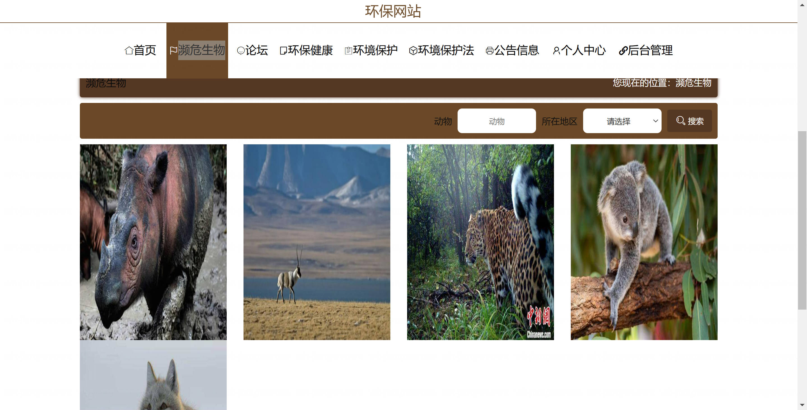

<h1 align="center">基于SpringBoot+MyBatis-Plus的环保网站管理系统【带论文】</h1>

- <b>完整代码获取地址：从戎源码网 ([https://armycodes.com/](https://armycodes.com/))</b>
- <b>技术探讨、资料分享，请加QQ群：692619798</b>
- <b>作者微信：19941326836  QQ：3645296857</b>
- <b>承接计算机毕业设计、Java毕业设计、Python毕业设计、深度学习、机器学习</b>
- <b>选题+开题报告+任务书+程序定制+安装调试+论文+答辩ppt 一条龙服务</b>
- <b>所有选题地址 ([https://github.com/Descartes007/allProject](https://github.com/Descartes007/allProject)) </b>

## 一、项目介绍

基于SpringBoot+MyBatis-Plus的环保网站管理系统，系统角色分为“管理员（后台）”与“普通用户（前端）”，主要功能如下
### 管理员（后台）：
- 基本操作：登录、修改密码、获取个人信息、修改个人信息、登出
- 用户管理：分页/筛选用户、查看用户详情、新增用户、修改用户、删除（逻辑/物理）
- 系统账号管理：管理员账号登录/注册/重置密码/会话信息获取
- 内容管理（统一 CRUD 模式）：濒危生物、环保健康、环境保护、环境保护法、新闻公告 等模块的分页列表、查看详情、新增/保存、修改、删除
- 论坛管理：帖子分页、帖子详情（含级联用户/管理员信息）、发帖/保存、修改、删除、批量导入
- 收藏与留言管理：收藏表与留言（Liuyan）模块的列表、详情、增删改
### 普通用户（前端）：
- 基本操作：注册、登录、修改密码、忘记/重置密码、获取/退出 session（登出）
- 浏览与互动：查看各模块前端列表（/list）、查看详情（/detail/{id}）
- 前端数据提交：前端新增（/add）、前端保存/修改（视模块而定）
- 论坛功能：前端用户发帖、查看帖子、留言/回复
- 收藏功能：前端收藏/查看收藏（Collection 模块）

## 二、项目技术

- 编程语言：Java（后端）、JavaScript / Vue（前端）
- 项目架构：B/S 架构（前后端分离前端单页应用）
- 前端技术：Vue.js、Vue Router、Element UI、axios
- 后端技术：Spring Boot、Spring MVC、MyBatis-Plus（ORM/Mapper）、自定义工具类（R, PageUtils, MPUtil）、Token + Session 认证机制

## 三、运行环境

- JDK版本：1.8及以上都可以
- 操作系统：Windows7/10、MacOS
- 开发工具：IDEA、Ecplise、MyEclipse都可以

## 四、数据库配置文件

- npm版本：6.14.13及以上都可以
- Redis版本：3.2.100及以上都可以
- 文件名：application.yml
- 编码类型：utf8

## 论文截图

## 系统截图

